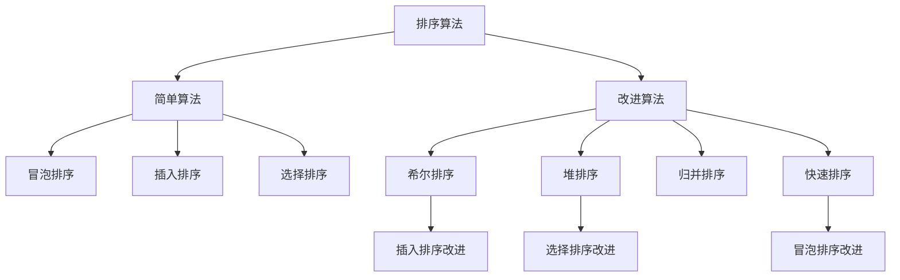
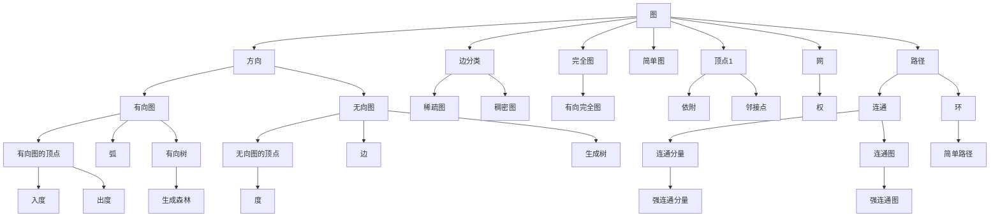
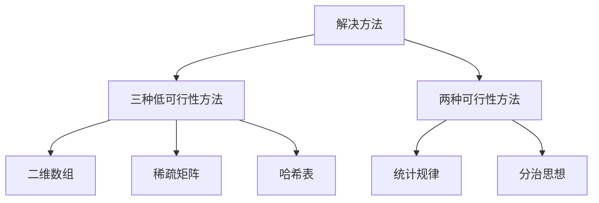

# 计算之魂——吴军

<center>——读书笔记与练习思考心shui&trade;总结&copy;杨桂淼

## 引：从机械到电子

硅谷这地儿的计算机博物馆收藏了2000多年前咱老祖发明的算盘，而且人家还把**算盘**作为最早的计算机。

咱们祖上是采用的**十六进制**计量单位；会打算盘的人并不需要熟悉数学运算，只要背下口诀即可，和背小九九似的。

### 计算机发展小史

> 把握历史的脉搏，才能看到未来的方向。:happy:

->2000多年前的中国，我们伟大的劳动人民发明了算盘；虽然从历史的角度算盘并不是严格意义上的第一个计算器，但是相比于古希腊的铜珠计算器，算盘并不需要熟悉数学运算，只要背下口诀即可，这就是类似于今天的指令控制。从算盘的设计和使用上可以看出构成计算机的三要素：**计算单元、存储单元、指令序列**

->1642年，法国数学家帕斯卡发明了最早的机械计算机。相比于算盘，帕斯卡设计的机械计算机的优点在于使用者不需要进行训练，当然不足之处就是计算之前的输入数据太慢，导致整个计算过程中耗时太长。由此现象反映出计算机发展史中一个大问题就是：**数据输入（和输出）的速度可能远远跟不上计算的速度**。

->查尔斯·巴贝奇于1822年研制出了一台小型差分机用于微积分计算，精度可以达到小数点后六位，但是巴贝奇终其一生想要提高到精度至小数点后20位也没有成功。但是他是最早想到用程序控制机械计算机的人。用复杂的方法解决复杂的问题就他的一个误区。

->乔治·布尔的主要贡献在于用过二进制将算术与简单地数理逻辑统一起来，并且为大家提供了一款工具——布尔代数。运算元素只有两个：**0（FALSE）和 1(TRUE)**；基本的运算只有**与或非**三种。

->香农从理论上指出任何逻辑控制和计算都与开关电路等价。比如：接通为1，闭合为0；高电压为1，低电压为0。1937年香农完成硕士论文《继电器和开关电路的符号分析》，被誉为是20世纪最重要的硕士论文，奠定了今天所有数字电路的设计基础，彪炳千秋。设计思路主要是两方面：模块化、等价性。**模块化**就是去运用简单的方法去解决复杂的问题，**等价性**就是在复杂的计算都可以等价成很多的加减乘除运算，进而等价成开关电路的逻辑运算。

->德国工程师楚泽，纯工程师出身，得益于二战的战备刺激，凭借良好的数学基础创造完成了二进制与十进制转换的计算器。虽然造出来实物，但遗憾的是没有想香农一样提出一套完整的理论。人类第一台**可编程计算机**出自这位大佬之手。

->图灵与他的两位“老师”：诺伊曼和希尔伯特。两位巨人老师在此不过多的赘述，其贡献在数学与计算机领域不可估量。图灵通过与二位大佬的学习，懂得了从边界做事情。也就是说从计算的本质去思考计算机的极限。虚构出图灵机，提出储存地址、计算机状态、规则表和当前位置读写头四个重要概念。

### 人工智能的极限

今天的AI主要是基于大数据的深度学习，至今为止，计算机的相关理论和技术发展都没有超越图灵机的范畴。可计算问题只是工程可解问题的一个小子集，AI之所以显得智能聪明，就是把过去很多大家没有找到转变为数学问题的桥梁，现在找到了而已。

#### 思考题目

> 如何通过指令控制，将一副扑克牌变成一种简单的计算机？
>
> 因为本人不会打算盘，所以在解释排列组合时难免理解不妥，恳请各位大佬们指点:expressionless:respect!

首先这是一个抽象类比，类比的具体事物就是前文中一直提到的算盘。细心的读者会发现，吴老师为甚么会让扑克牌去模拟计算机呢？答案是：**结构**。不妨仔细去观察一下，算盘的列数是13列，扑克牌的种类有：A 1 2 3 4 5 6 7 8 9 J Q K正好是13种。山重水复疑无路，看到这里，想必大家已经豁然开朗。我们完全可以让13种扑克牌去做算盘的13列啊。每一列下面具有四种不同花色共计4！=24种组合方式，用不同排列组合的同大小不同花色的扑克模拟纵向的操作,利用这些组合去模拟算盘的运算单元。指令序列可以仿照算盘的运算规则，也可以自己去创新一套运算法则。当在指令序列控制下，借助运算单元完成操作时，结果自动存储在其中，会打算盘的人读取结果即可完成计算操作。

> 利用与-非（AND-NOT）运算实现布尔代数中的与、或、非三种运算。:heart:

与-非门$X=\overline{A\cdot B}$推出：

- 非门$X=\overline{A\cdot A}$
- 与门$X=\overline{A\cdot B}=AB$
- 或门$X=\overline{\overline{A}\cdot \overline{B}}=A\cup B$

> 华为P30消耗1度电可以进行多少次运算？:chicken:

参考学习知乎答主:[鳄鱼](https://www.zhihu.com/people/crocodile-29)

> ENIAC：
>        功率：150KW；计算速度：5000次/s；
>
>  华为P30（麒麟980芯片）：
> 	功率：4W；最高主频：2.6GHz；

1. 功率：指物体在单位时间内所做的功的多少，是描述做工快慢的物理量。国际单位为瓦特（W）
2. 能量：物质运动转换的量度，是表征物理系统做工的本领的量度。国际单位为焦耳（J）
3. 频率：单位时间内完成周期性变化的次数，是描述周期运动频繁程度的量。国际单位为赫兹（Hz），也就是秒分之一

> 1度电 = 1千瓦时 = 1KW·h = 1000(W) * 3600(s)= 3.6e6(J）；
> 	ENIAC的功率为150KW意味着这个大家伙每秒钟要消耗的能量为E(E) = 150 * 1000 * 1 = 1.5e5(J)；
> 	ENIAC每秒计算次数为5000次；
> 	于是，可得ENIAC计算1次需要消耗的能量E1 = E(E) / 5000 = 1.5e5 / 5000 = 30(J)；
> 	所以，ENIAC消耗一度电，可以进行的运算次数T(E) = 3.6e6 / 30 = 1.2e5(次)。

> 麒麟980芯片每秒要消耗的能量为E(P) = 4 * 1 = 4(J)；
> 	由最高主频可得，麒麟980芯片每秒计算次数为2.6e9次；
> 	于是，可得麒麟980芯片计算1次需要消耗的能量E2 = E(P) / 2.6e9 (J);
> 	最终，麒麟980消耗1度电，可以进行的运算次数T(P) = 3.6e6 * 2.6e9 / 4 = 2.34e15(次)

## 大O概念

### 算法的五大特性

> ->大话数据结构-程杰

算法具有五个基本特性：**输入**、**输出**、**有穷性**、**确定性**和**可行性**。

1. 输入输出：

   输入和输出特性比较容易理解，算法具有零个或多个输入。算法至少有一个或多个输出，算法是一定需要输出的，不需要输出，你用这个算法干吗？输出的形式可以是打印输出，也可以是返回一个或多个值等。

2. 有穷性

   认识到一个问题的**边界**。有穷性：指算法在执行有限的步骤之后，自动结束而不会出现无限循环，并且每一个步骤在可接受的时间内完成。现实中经常会写出死循环的代码，这就是不满足有穷性。当然这里有穷的概念并不是纯数学意义的，而是在实际应用当中合理的、可以接受的“有边界”。

3. 确定性

   确定性：算法的每一步骤都具有确定的含义，不会出现**二义性**，相同的输入只能有唯一的输出结果。算法的每个步骤被精确定义而无歧义。

4. 可行性

   可行性：算法的每一步都必须是可行的，也就是说，每一步都能够通过执行有限次数完成。可行性意味着算法可以转换为程序上机运行，并得到正确的结果。

> 毫厘千里之差
>

图灵提出来计算机的数学模型，诺依曼确定了计算机通用的系统结构，而高德纳奠定了计算机的算法基础。

- 理解大数和数量级的概念：

  讨论算法的时间复杂度时，只考虑N趋近于无穷时和N相关的部分。->O($N^2+3N+8$)~O($N^2$)

- 算法的规范度量

  算法的时间复杂度我们用`O`(大:o:)记录。函数的边界也可以用大O的概念进行限制。

- 计算机科学家很多时候是把注意力放在**数量级**的差异上。


### 如何寻找好的算法

什么是好的算法？

> 好的算法具有的特性-部分内容学习参考《大话数据结构》-程杰.TSU

1. 正确性

   正确性：算法的正确性是指算法至少应该具有输入、输出和加工处理无歧义性、能正确反映问题的需求、能够得到问题的正确答案。最起码，你写bubbl_sort最后得得出一个升序排序数组吧；写swap函数最后要实现两个变量之间位置的交换吧。

   运用**马斯洛需求层次理论**，对于正确性的理解有四个层次：

   - 温饱阶段（自身安全）->算法程序没有语法错误。
   - 脱贫攻坚（基本欲望）->算法程序对于**合法的输入数据**能够产生满足要求的输出结果。
   - 全面小康（利他之心）->算法程序对于**非法的输入数据**能够得出满足规格说明的结果。
   - 共同富裕（自我超越）->算法程序对于精心选择的，甚至**刁难的测试数据**都有满足要求的输出结果。

2. 可读性

   可读性：算法设计的另一目的是为了便于阅读、理解和交流。受众不同就需要调整代码的语法引用。人家一个小白，你一上来就让人家看指针、结构体，数组传参int *a,这些写法，行家看来你是基础很好，但是对于初学者太不友好。人家看都看不懂，怎么对你这代码进行评价呢。考虑受众、考虑大众。写代码的目的，一方面是为了让计算机执行，但还有一个重要的目的是为了便于他人阅读，让人理解和交流，自己将来也可能阅读，如果可读性不好，时间长了自己都不知道写了些什么。可读性是算法（也包括实现它的代码）好坏很重要的标志。

3. 健壮性/鲁棒性

   鲁棒性：当输入数据不合法时，算法也能做出相关处理，而不是产生异常或莫名其妙的结果。一个好的算法还应该能对输入数据不合法的情况做合适的处理。

4. 时间复杂度

   好的算法还应该具备时间效率高的特点。

5. 空间复杂度

   好的算法还应该具备存储量低的特点。

写算法之前，一定要对问题有一个**边界**认识，至少知道最暴力的解法的时间复杂度，那么最做优化时，就尽可能去降低这个复杂度上界。好的算法不会做大量的无用功与重复计算，好的算法运用的思维一般人想不到。比如计算机擅长的**逆向思维**。


#### 例题1.3：总和最大区间

`写在前面`

大佬们看到这篇小文章肯定会吐槽，这小子写程序怎么只会用for循环啊…:sweat_smile:

最近一直在读吴军老师的《计算之魂》，在学着去写递归函数。但是能力有限，思维开始一点点的调整过来，但是书写上还需要点时间练习，打磨技术。脱离了递归思想的支撑（其实也就脱离了计算机的灵魂），我就用最基本的程序设计方法做的咱们书上的这道思考题目。虽然没用用上递归，但是我力求把程序书写思路写清楚，增加其可读性。

这也符合了本书吴军老师的写作思路，因为`递归`的思想在下一章才会进行详细的讲解。

后面当我递归函数书写熟练以后，我也一定会回来去修改这些代码的！

------

`题目描述`

对于给定是实数序列，设计一个算法，找到一个总和最大的区间。

书中吴老师给出的序列为：`float nums[13] = {1.5,-12.3,3.2,-5.5,23.2,3.2,-1.4,-12.2,34.2,5.4,-7.8,1.1,-4.9}`

`特殊情况：`如果数组中只有一个正数，那么这个正数对应的索引区间就是总和最大区间。

##### 方法1

方法1就是利用三层for循环，利用排列组合的思想：头指针从nums[0]开始到nums[12]把数组扫一遍，尾指针从头指针的位置开始到nums[12];组合方式0(K^2^)种，在每一种组合中平均要做K/4次求和运算。

> 优点：书写思路直观、较简洁
>
> 缺点：做了太多的无用功。

无用功从何而来呢？

假设区间的起点是nums[0]，终点是nums[k] (0 < k <13),使用方法1在计算sum(0,k+1)时，会从头开始计算，而不是在已有sum[0,k]的结果之上加上nums[k + 1]，所以会产生大量的无用用功。数据量小无所谓，但是当数据量提升量级的时候，运算时间上就会逐渐产生极大地差别。

```c
//这个代码一开始把sum的位置放在了三个foe循环的外面
//调试发现：造成每次进入第三个for求sum时，sum仍然保留着前面结果
//以至于结果出错
#include<stdio.h>
//最大值函数
float max(float a , float b){
    
	return a > b ? a : b;
}
//主函数
int main(void){
	
	float ans = 0.0;//结果变量
	//找出总和最大的区间
	float nums[13] = {1.5,-12.3,3.2,-5.5,23.2,3.2,-1.4,-12.2,34.2,5.4,-7.8,1.1,-4.9};//题目中已知的数组
	for(int i = 0;i < 13;i++){
		for(int j = i;j < 13;j++){
			//计算区间[i,j]的和
			float sum = 0.0;//数组求和结果
			for(int m = i;m <= j;m++){
				sum += nums[m];
			}
			ans = max(ans,sum);
		}
	}
	printf("the result is:%f",ans);
	return 0;	
}
```

> the result is: 52.400005
>
> Process exited after 0.01438 seconds with return value 0

##### 方法2

折腾了两天了，始终不明白第二问咋想、咋做。倒是先把第四问做出来了…

反复重读书中这句话（P38）：在方法2中，我们先假设区间的左边界p，再次确定的条件下确定综合最大区间的右边界q。

好啦，运用方法2解决这个问题的第一步就是，我怎么去找这个右边界啊？:weary:

吴军老师在书中解释到的需要记录的三个值：

- 从p开始到当前位置q为止的总和sum(p,q)
- 从p开始到当前位置q为止所有和中的最大值Maxsum
- 区间的结束位置

那么好了，p就是从头开始正向扫描，扫描一遍得到最大值和最大值对应的索引下标。因为max = sum(p,q) > sum(p,q+1)当q增大时恒成立，也就是说，最大值索引下标之后无论数组有多长，加上那个nums[p+1]后，总会使sum(p,q+1)小于max=sum(p,q)。

| 序号       |  1   |   2   |  3   |   4   |  5   |  6   |  7   |   8   |  9   |  10  |  11  |  12  |  13  |
| ---------- | :--: | :---: | :--: | :---: | :--: | :--: | :--: | :---: | :--: | :--: | :--: | :--: | :--: |
| 元素       | 1.5  | -12.3 | 3.2  | -5.5  | 23.2 | 3.2  | -1.4 | -12.2 | 34.2 | 5.4  | -7.8 | 1.1  | -4.9 |
| 向前累加和 | 1.5  | -10.8 | -7.6 | -13.1 | 10.1 | 13.3 | 11.9 | -0.3  | 33.9 | 39.3 | 31.5 | 32.6 | 27.7 |

<center>表：元素累加和

<center>
    
</center>

```c
#include<stdio.h>

//最大值函数
float max(float a , float b){
    
	return a > b ? a : b;
}

int main(void){
	
	//先去把有边界确定好
	float Max = 0.0;
	float nums[13] = {1.5,-12.3,3.2,-5.5,23.2,3.2,-1.4,-12.2,34.2,5.4,-7.8,1.1,-4.9};//题目中已知的数组
	int left,right = 0;//左、右边界确定指针
	float ans = 0.0;
	float anw[13];
	
	//求正向累加序列
	for(int i = 0;i < 13;i++){
		float sum = 0.0;
		for(int j = 0;j <= i;j++){
			sum += nums[j];	
		}
		anw[i] = sum;	
	}
	//确定右边界
	for(int i = 0;i < 13;i++){
		ans = max(ans,anw[i]);
	}
	for(int i = 0;i < 13;i++){
		if(anw[i] == ans){
			right = i;
		}
	}
	//注意右边界为区间右端+1
	for(int i = 0;i < right + 1;i++){
		float sum = 0.0;
		for(left = i;left < right + 1;left++){
			sum += nums[left];
		}
		Max = max(sum,Max);
	}
	printf("%f",Max);
	return 0;
}
```

> 52.400005
>
> Process exited after 0.0121 seconds with return value 0

##### 方法3

分治思路：

将序列分为：1-K/2和K/2-K两部分。由于这个问题中数组中含有13个奇数元素，所以我直接从第七个元素开始划分左右子序列。由于现在我递归函数写的不好，所以整个过程都是用for循环实现的，代码冗余度较高，空间复杂度大，但是思路还是顺畅的，场上到下一气呵成。第三问、第四问总结起来都是从第二问的延伸扩展。第三问只不过把问题的尺度缩小了，将一个长序列转换为分隔成为了两个子序列，所以会写递归就会节省很大的空间复杂度，目前写不出递归，那么就要消耗空间。因为啥？因为子序列的处理和一个长序列的处理步骤、方法是一致的。比如，一个长序列，写两个for循环就解决了；但是现在你分成了两个子序列，所以连个for循环就要用两遍…

`分治的思想`一定是要掌握的，特别是在递归函数熟练书写之后，再次反刍这道题，一定会有不一样的收获。:rose:

```c
#include<stdio.h>

//两个数的最大值函数
float max(float a , float b){

	return a > b ? a : b;
}
//三个数的最大值函数
float maxthree(float a , float b, float c){
	//三目简洁运算，比较得到三个数的最大值
	return a > b ? a > c ? a : c : b > c ? b : c;
}

//分治思想
int main(void){
	
	//先去把有边界确定好
	float Max1 = 0.0;
	float Max2 = 0.0;
	float nums[13] = {1.5,-12.3,3.2,-5.5,23.2,3.2,-1.4,-12.2,34.2,5.4,-7.8,1.1,-4.9};//题目中已知的数组
	int left1,right1 = 0;//左子序列的左、右边界确定指针
	int left2,right2 = 0;//右子序列的左、右边界确定指针
	float ans1 = 0.0;//左子序列的最大值
	float ans2 = 0.0;//右子序列的最大值
	float anw1[13];//左子序列的最大值
	float anw2[13];//左子序列的最大值
	
	//求右部分正向累加序列
	for(int i = 0;i < 7;i++){
		float sum = 0.0;
		for(int j = 0;j <= i;j++){
			sum += nums[j];	
		}
		anw1[i] = sum;	
	}
	//确定右部分的右边界
	for(int i = 0;i < 7;i++){
		ans1 = max(ans1,anw1[i]);
	}
	for(int i = 0;i < 7;i++){
		if(anw1[i] == ans1){
			right1 = i;
		}
	}
	//注意右边界为区间右端+1
	for(int i = 0;i < right1 + 1;i++){
		float sum = 0.0;
		for(left1 = i;left1 < right1 + 1;left1++){
			sum += nums[left1];
		}
		Max1 = max(sum,Max1);
	}
	
	//-------------------------------------------------------------	
	//求左部分正向累加序列
	for(int i = right1;i < 13;i++){
		float sum = 0.0;
		for(int j = 0;j <= i;j++){
			sum += nums[j];	
		}
		anw2[i] = sum;	
	}
	//确定右部分的右边界
	for(int i = right1;i < 13;i++){
		ans2 = max(ans2,anw2[i]);
	}
	for(int i = right1;i < 13;i++){
		if(anw2[i] == ans2){
			right2 = i;
		}
	}
	//注意右边界为区间右端+1
	for(int i = right1;i < right2 + 1;i++){
		float sum = 0.0;
		for(left2 = i;left2 < right2 + 1;left2++){
			sum += nums[left2];
		}
		Max2 = max(sum,Max2);
	}
    
	//分别找出左子序列[p1,q1]最大值/右子序列[p2,q2]/整个区间[p1,q2]三者的最大值
	float Max3 = 0.0;
    //求和索引期间为[right1 - 1,right2 + 1]
	for(int i = 4;i < 10;i++){
		Max3 += nums[i];
	}
    //-----------------------------------------------------------------
	float maxsum = maxthree(Max1,Max2,Max3);
	printf("%d\n",right1);
	printf("%d\n",right2);
	printf("the final result is %f\n",maxsum);
	return 0;
}
```

> the final result is 52.400005
>
> Process exited after 0.01318 seconds with return value 0

##### 方法4

正反双向扫描->逆向思维

首先吐槽一下自己写的代码，虽然结果运行没错，但是我认为求最值问题可以转化为滑动窗口或者动态规划；现阶段本人水平有限，一直也在思考新的思路，也恳请各位大佬将自己的思路share,已改进下面的代码。

一直感觉这种方法可以用动态规划的思路去解决，但是由于动态规划的思路目前还没有熟练掌握，所以编写过程还是停留在了运用for循环的方式上…

反向扫描去找到左节点是解决本题的关键所在，这也是需要学习的思想->逆向思维。

```c
#include<stdio.h>

//最大值函数
float max(float a , float b){
    
	return a > b ? a : b;
}
//主函数
int main(void){
	
	//找出总和最大的区间 
	float nums[13] = {1.5,-12.3,3.2,-5.5,23.2,3.2,-1.4,-12.2,34.2,5.4,-7.8,1.1,-4.9};//题目中已知的数组
	int left = 0,right = 0;//左右指针确定最终区间
	float res = 0.0;//最终结果
	float ans = 0.0;//结果变量
	float ans1 = 0.0,ans2 = 0.0;//双向扫描后的最大值
	float anw1[13];//正向扫描累加序列
	float anw2[13];//反向扫描累加序列
	
	//求正向累加序列
	for(int i = 0;i < 13;i++){
		float sum = 0.0;
		for(int j = 0;j <= i;j++){
			sum += nums[j];	
		}
		anw1[i] = sum;	
	}
	//求反向累加序列
	for(int i = 12;i >= 0 ;i--){
		float sum = 0.0;
		for(int j = 13;j >= i;j--){
			sum += nums[j];	
		}
		anw2[i] = sum;	
	}
	//确定右边界
	for(int i = 0;i < 13;i++){
		ans1 = max(ans1,anw1[i]);
	}
	for(int i = 0;i < 13;i++){
		if(anw1[i] == ans1){
			right = i;
		}
	}
	//确定左边界
	for(int i = 0;i < 13;i++){
		ans2 = max(ans2,anw2[i]);
	}
	for(int j = 0;j < 13;j++){
		if(anw2[j] == ans2){
			left = j;
		}
	}
	//求最终结果
	for(int m = left;m <= right;m++){
		res += nums[m];
	}
	printf("the final result is =%f",res);
	return 0;
}
```

> the final result is =52.400005
>
> Process exited after 0.009718 seconds with return value 0

不会用递归，好的方法代码越写越长…

所以，路漫漫其修远兮，吾将上下而求索！

### 关于排序的讨论

一开始想要分块写来着，但是正好赶上周末。这两天看程杰老师的大话数据结构如痴如醉，兴致来了，把排序算法刷一遍。

->排序本身分为两大类：内排序和外排序

内排序：待排序的所有记录全部放在内存中。

外排序：由于排序记录个数太多，不能同时存放在内存中，整个排序过程需要在内存与外存之间多次进行数据交换。

对于内排序而言，算法性能主要收到三方面的影响：

1. 时间性能：时间开销是衡量其好坏的重要标志
2. 辅助空间：除了存放待排序所占用的存储空间以外，还有执行算法需要的其他空间。
3. 算法复杂度：考虑算法本身的复杂度。



**排序算法时间复杂度总结**

|   方法   |      平均方法      |   最好情况   |  最坏情况  |    辅助空间    | 稳定性 |
| :------: | :----------------: | :----------: | :--------: | :------------: | :----: |
| 冒泡排序 |      $O(N^2)$      |    $O(N)$    |  $O(N^2)$  |     $O(1)$     |  稳定  |
| 选择排序 |      $O(N^2)$      |   $O(N^2)$   |  $O(N^2)$  |     $O(1)$     |  稳定  |
| 插入排序 |      $O(N^2)$      |    $O(N)$    |  $O(N^2)$  |     $O(1)$     |  稳定  |
| 希尔排序 | $O(nlog_n)-O(N^2)$ | $O(N^{1.3})$ |  $O(N^2)$  |     $O(1)$     | 不稳定 |
|  堆排序  |     $O(nlogn)$     |  $O(nlogn)$  | $O(nlogn)$ |     $O(1)$     | 不稳定 |
| 归并排序 |     $O(nlogn)$     |  $O(nlogn)$  | $O(nlogn)$ |     $O(N)$     |  稳定  |
| 快速排序 |     $O(nlogn)$     |  $O(nlogn)$  |  $O(N^2)$  | $O(logn)-O(n)$ | 不稳定 |

编写线性表的前期操作：

```c
#include<stdio.h>
#include<stdlib.h>

#define MaxSize 1000
#define TRUE 1
#define FALSE 0
typedef int Status; 
//定义线性表结构体
typedef struct{
	int r[MaxSize+1];
	int length;
}Sqlist;

//定义交换函数
void swap1(Sqlist *L,int i,int j){
	int temp = L->r[i];
	L->r[i] = L->r[j];
	L->r[j] = temp;
}

void Print_arr(int *a,int size){
	
	for(int i = 0;i < size;i++){
		printf("%d\t",a[i]);
	}
	printf("\n\n");
    
#define N 9
int main()
{
   int i;
   
   /* int d[N]={9,1,5,8,3,7,4,6,2}; */
   int d[N]={50,-1,-90,-30,70,40,-80,-860,2000};
   /* int d[N]={9,8,7,6,5,4,3,2,1}; */

   SqList l0,l1,l2,l3,l4,l5,l6,l7,l8,l9,l10,l11;
   
   for(i=0;i<N;i++)
     l0.r[i+1]=d[i];
   l0.length=N;
   l1=l2=l3=l4=l5=l6=l7=l8=l9=l10=l11=l0;
   printf("排序前:\n");
   print(l0);

   printf("初级冒泡排序:\n");
   BubbleSort0(&l0);
   print(l0);
   
   printf("冒泡排序:\n");
   BubbleSort(&l1);
   print(l1);
   
   printf("改进冒泡排序:\n");
   BubbleSort2(&l2);
   print(l2);
   
   printf("选择排序:\n");
   SelectSort(&l3);
   print(l3);
   
   printf("直接插入排序:\n");
   InsertSort(&l4);
   print(l4);

   printf("希尔排序:\n");
   ShellSort(&l5);
   print(l5);
	
   printf("堆排序:\n");
   HeapSort(&l6);
   print(l6);

   printf("归并排序（递归）:\n");
   MergeSort(&l7);
   print(l7);

   printf("归并排序（非递归）:\n");
   MergeSort2(&l8);
   print(l8);

   printf("快速排序:\n");
   QuickSort(&l9);
   print(l9);

   printf("改进快速排序:\n");
   QuickSort1(&l10);
   print(l10);

   printf("改进快速排序(尾递归):\n");
   QuickSort2(&l11);
   print(l11);
   return 0;
}
```

#### bubble sort

选择排序（冒泡排序）

分析无用功出现在哪？

```c
//冒泡排序的改进
//不发生数据交换flag的值为false,不在进行比较
void BubbleSort2(Sqlist *L){
	int i,j;
	Status flag = TRUE;
	for(i = 1;i < L->length;i++){
		flag = FALSE;
		for(j = L->length-1;j >= i;j--){//注意这里j的取值是从尾部向前循环
			if(L->r[j] > L->r[j+1]){//真正的自底向上起泡
				swap1(L,j,j+1);
				flag = TRUE;
			}
		}
	}
}
```


#### insert sort

插入排序对于少量数据而言是一个有效的算法，他的工作方式类似于人们打扑克牌是的排序过程。拿到一张牌，如果这张牌的点数小于此时手里的目标牌，那么就将其插入到目标牌的左边。

```c
//插入排序
//开始要设置一个哨兵监视
void InsertSort(Sqlist *L){
	
	int i,j;
	for(int i = 2;i <= L->length;i++){
		
		if(L->r[i] < L->r[i - 1]){
			L->r[0] = L->r[i];
			for(j = i -1;L->r[j]>L->r[0];j--){
				L->r[j+1] = L->r[j];
			}
			L->r[j+1] = L->r[0];
		}
	}
}
```

#### selection sort

```c
//简单选择排序
void SelectSort(Sqlist *L){
	
	int i,j,min;
	for(i = 1;i<L->length;i++){
		min = i;
		for(j = i+1;j<=L->length;j++){
			
			if(L->r[min] > L->r[j]){
				min = j;
			}
		}
		if(i != min){
			swap1(L,i,min);
		}
	}
}
```


#### merge sort

方法创始人：冯·诺依曼

```c
void MSort(int SR[],int TR1[],int s, int t)
{
	int m;
	int TR2[MAXSIZE+1];
	if(s==t)
		TR1[s]=SR[s];
	else
	{
		m=(s+t)/2;				/* 将SR[s..t]平分为SR[s..m]和SR[m+1..t] */
		MSort(SR,TR2,s,m);		/* 递归地将SR[s..m]归并为有序的TR2[s..m] */
		MSort(SR,TR2,m+1,t);	/* 递归地将SR[m+1..t]归并为有序的TR2[m+1..t] */
		Merge(TR2,TR1,s,m,t);	/* 将TR2[s..m]和TR2[m+1..t]归并到TR1[s..t] */
	}
}

/* 对顺序表L作归并排序 */
void MergeSort(SqList *L)
{ 
 	MSort(L->r,L->r,1,L->length);
}
```

#### Shell_sort

```c
/* 对顺序表L作希尔排序 */
void ShellSort(SqList *L)
{
	int i,j,k=0;
	int increment=L->length;
	do
	{
		increment=increment/3+1;/* 增量序列 */
		for(i=increment+1;i<=L->length;i++)
		{
			if (L->r[i]<L->r[i-increment])/*  需将L->r[i]插入有序增量子表 */ 
			{ 
				L->r[0]=L->r[i]; /*  暂存在L->r[0] */
				for(j=i-increment;j>0 && L->r[0]<L->r[j];j-=increment)
					L->r[j+increment]=L->r[j]; /*  记录后移，查找插入位置 */
				L->r[j+increment]=L->r[0]; /*  插入 */
			}
		}
		printf("第%d趟排序结果: ",++k);
		print(*L);
	}
	while(increment>1);

}
```


#### Heap_sort

```c
//堆排序
void Heap_Sort(Sqlist *L){
	int i;
	//调整最大堆
	for(i = L->length/2;i>0;i--){
		HeapAdjust(L,i,L->length);
	}
	//
	for(i = L->length;i>1;i--){
		swap1(L,1,i);
		HeapAdjust(L,1,i-1);
	}
}
//大顶堆调整函数
void HeapAdjust(Sqlist *L,int s,int m){
	int temp,j;
	temp = L->r[s];
	for(j = 2*s;j<=m;j*=2){
		if(j<m && L->r[j]<L->r[j+1]){
			++j;
		}
		if(temp>=L->r[j]){
			break;
		}
		L->r[s] = L->r[j];
		s = j;
	}
	L->r[s] = temp;	
}
```


#### Quick_sort

```c
void QuickSort(SqList *L)
{ 
	QSort(L,1,L->length);
}
void Quick_sort(int a[],int low,int high){
	//int pivot;
	if(low < high){
		
		int pivot = Partition(a,low,high);
		Quick_sort(a,low,pivot);
		Quick_sort(a,pivot+1,high);
		
	}
}

int Partition(int a[],int low,int high){
	
	int pivotkey;
	//三选一进行数轴量的选取
	int mid = low + (high - low)/2;
	if(a[low] > a[high]){
		swap(&a[low],&a[high]);
	}
	if(a[mid] > a[high]){
		swap(&a[mid],&a[high]);
	}
	if(a[mid] > a[low]){
		swap(&a[mid],&a[low]);
	}
	pivotkey = a[0];
	while(low < high){
		
		while(low < high && a[low] <= pivotkey)
			low++;
		a[high] = a[low];
		while(low < high && a[high] >= pivotkey)
			high--;
		a[low] = a[high];
	}
	a[low] = a[0];
	return low;
}
```


## 递推->递归

### 汉诺塔相关

```c
#include<stdio.h>
//移动函数
void move(char a,char b){
	printf("%c --> %c\n",a,b);
}
//honoi函数
//参数设置：A为初始盘子，C为目标盘子，B为周转盘子
void honoi(int n,char A,char B,char C){
	if(n == 1){
		move(A,C);
	}
	else{
		honoi(n - 1,A,C,B);
		move(A,C);
		honoi(n - 1,B,A,C);
	}
}
//主函数
int main(void){
	int n;
	printf("please input a number:\n");
	scanf("%d",&n);
	honoi(n,'A','B','C');
	return 0;
	
}
```

汉诺塔递归结果对比：

| 序号 | 盘子数量 | 运行时间/s |
| :--: | :------: | :--------: |
|  1   |    3     |    1.3     |
|  2   |    5     |    1.83    |
|  3   |    8     |    1.92    |
|  4   |    10    |    3.2     |
|  5   |    15    |    7.2     |
|  6   |    20    |   36.47    |

### 二叉树


## 编码-抽象表示


## 分类与组合

## 图论

图是由顶点的有穷非空集合和顶点之间边的集合组成的，通常表示为G(V,E);其中，G表示一个图，V是G中的顶点的集合，E是图G中的边的集合。

构成图的两大元素：**顶点**和**边**。

### 基本概念

基本定义关系梳理(多叉树)：



无向边：若顶点$V_i$到 $V_j$之间的边没有方向，则称这条边为无向边。用无序偶对($V_i ,V_j$)表示，组成的图成为无向图。

有向边：若顶点$V_i$到 $V_j$之间的边有方向，则称这条边为有向边。用有序偶对<$V_i ,V_j$>表示，组成的图成为有向图。有向边也称为弧，$V_i$表示弧头，$V_j$表示弧尾。

在无向图中，任意两个顶点之间都存在边，则该图称为无向完全图。

在有向图中，如果任意两个顶点之间都存在方向相反的两条弧，则称为有向完全图。

与图的弧或者边相关的数叫做权，带权的图称为网。

### 图的两种创建方式

初始化设置：

```c
#include<stdio.h>
#include<stdlib.h>

//邻接矩阵

typedef char VertexType;
typedef int EdgeType;
#define MAXVEX 100
#define INFINITY 10000

```

邻接矩阵创建：

```c
typedef struct 
{
	VertexType vexs[MAXVEX];//顶点数组
	EdgeType arc[MAXVEX][MAXVEX];
	int numNodes,numEdges;
}MGraph;

//建立无向图
void Creat_MGraph(MGraph *G){
	int i,j,k,w;
	printf("输入顶点数和边数：\n");
	scanf("%d,%d",&G->numNodes,&G->numEdges);
	//判断有多少个节点
	for(i = 0;i < G->numNodes;i++){
		scanf(&G->vexs[i]);
	}
	//初始化邻接矩阵
	for(i = 0;i < G->numNodes;i++){
		for(j = 0;j < G->numNodes;j++){
			G->arc[i][j] = INFINITY;
		}
	}
	for(k = 0;k < G->numEdges;k++){
		printf("请输入边(vi,vj)所对对应的下标i，下标j和权重w\n");
		scanf("%d,%d,%d",&i,&j,&w);
		G->arc[i][j] = w;
		G->arc[j][i] = G->arc[i][j];
	}
}
```

邻接表创建：

```c
//邻接表
typedef struct EdgeNode{//边表节点
	int adjvex;
	EdgeType info;//用于存放权重，无向图可以为空
	struct EdgeNode *next;
}EdgeNode;

typedef struct VertexNode{//顶点表节点
	VertexType data;
	EdgeNode *firstedge;
}VertexNode,AdjList[MAXVEX];

typedef struct 
{
	AdjList adjlist;
	int numNodes,numEdges;
}GraphAdjList;

void Creat_AdjGraph(GraphAdjList *G){
	
	int i,j,k;
	EdgeNode *e;
	printf("输入顶点数和边数：\n");
	scanf("%d,%d",&G->numNodes,&G->numEdges);
	for(i = 0;i<G->numNodes;i++){
		scanf(&G->adjlist[i].data);
		G->adjlist[i].firstedge = NULL;
	}
	//类似于头插
	for(k = 0;k < G->numEdges;j++){
		printf("请输入边(vi,vj)上的顶点序号：\n");
		scanf("%d,%d",&i,&j);
		e = (EdgeNode*)malloc(sizeof(EdgeNode));
		e->adjvex = j;
		e->next = G->adjlist[i].firstedge;
		e = (EdgeNode*)malloc(sizeof(EdgeNode));
		e->adjvex = i;
		e->next = G->adjlist[j].firstedge;
		G->adjlist[j].firstedge = e;
		
	}
}
```

### 图的动态连通性

> 参考文章：labulandong - Union Find 并查集算法原理及应用

并查集（Union-Find）算法是一个专门针对动态连通性的算法。

这里所说的**连通**是一种等价关系，也就是说具有如下三个性质：

1、自反性：节点`p`和`p`是连通的。

2、对称性：如果节点`p`和`q`连通，那么`q`和`p`也连通。

3、传递性：如果节点`p`和`q`连通，`q`和`r`连通，那么`p`和`r`也连通。

连通也就意味着图的全部节点都是遍历到的，并且节点与节点之间不在重复连接。比如说，以传递性为例，A-B是联通的、B-C也是联通的，那么A-C自然而然也是联通的。无需再将A-C进行强行串联。在克鲁斯卡尔算法当中，当把表边权重由大到小进行排序完成后，不断选边优化的过程就是一个并查集过程。比如，权重最小的前三个恰好是A-B、B-C、A-C；那么在选中A-B、B-C后，第三次进行选边的时候就要跳过A-C边继续向下选边。

使用森林（若干棵树）来表示图的动态连通性，用数组来具体实现这个森林。设定树的每个节点有一个指针指向其父节点，如果是根节点的话，这个指针指向自己。

```c
int parent[MAXSIZE];
for(int i = 0;i < G.numvertexes;i++){
    parent[i] = 0;
}
for(int i = 0;i < G.numedges;i++){
    n = Find(parent,edges[i].begin);
    m = Find(parent,edges[i].end);
    if(n != m){
        parent[n] = m;
    }
}
int Find(int *parent,int val){
    while(parent[val] > 0){
        val = parent[val];
    }
    return val;
} 
```

如果某两个节点被连通，则让其中的（任意）一个节点的根节点接到另一个节点的根节点上。这样，如果节点`n`和`m`连通的话，它们一定拥有相同的根节点。可以这样使用数组来模拟出一个森林，如此巧妙的解决这个比较复杂的问题！

## 分治

## 权衡时空-理解存储

本章重点理解计算机的存储，解决和存储有关的问题，就必须要了解计算机的存储结构，以及不同存储设备的的特点。在任何时候，如果想要成为一个好的工程师，都需要了解计算机的存储结构。与存储相关的理论和技术大致可以被分为两个角度来讨论：

1. 围绕数据的使用特点和使用设备展开->比如数据是随机访问还是顺序访问，需要一次获取大量数据还是获取单个数据。
2. 围绕存储系统本身的体系机构特点展开。从信息角度看，计算机的本质是传输、处理、存储信息的机器，传输、处理可以被视为是一个直进直出结果，但是存储信息则是一个经过多层次的过程。

> 例题7.1
>
> 给定一个32位或者64位的二进制数，如何有效的数出其中1的数量？（MS、AB）

解法1：AB公司给出的x&(x-1)方法。假设$x=x_1,x_2\cdots x_n$,最右边的1是$x_i$,因此$x=x_1,x_2\cdots x_{i-1},1\cdots 0,0,\cdots 0$,并且x-1=$x=x_1,x_2\cdots x_{i-1},0\cdots 1,1,\cdots 1$。于是，x&(x-1)=$x=x_1,x_2\cdots x_{i-1},0\cdots 0,0,\cdots 0$，其中的1比x少了一个。当x&(x-1)=0时，说明x中不包含1了。

```c
int count = 0;
while(x&(x-1) != 0){
    count ++;
    x = x&(x-1);
}
```

解法2：将上述很长的“二进制数”以8位一个单元分成几部分。8位二进制数只能表示256种可能性，所以将每一种可能性对应的1的数量记录下来。在这个数组中，i[0]=0,i[1]=1,i[2]=1,i[3]=2…i[255]=8。对于任何一个二进制数只查一次表就可以了。

255的二进制为：1111 1111。

->PS：如果不考虑空间成本，分组K越大，时间不一定越短。因为计算机的高速缓存区是有限的，在真实情况下，处理器不是直接从内存中读取数据，而日是从处理器和内存的之间的高速缓存区（cache）读取数据，高速缓存区容量很小，存不下大的数组。


### 访问：顺序OR随机

顺序存储和随机存储，看到这两个概念的对比，我就想起来两种基本的数据结构：数组和链表（最近在复习数据结构）。本质上来说，数组和链表都属于线性表。malloc一个堆空间后，数组中所有的元素肯定都是从首地址出发开始，以4个字节连续存储每一个元素（以int形为例）。相反，链表在存储过程中不是连续的，而是通过指针将他们串联起来，所以看起来是连续的，实际存储则是靠指针将分散存储的数据连接起来的。这是我对顺序和随机的一点理解，下面结合例题，总结一下吴老师的观点。

> 例题7.2	高频单词的二元组问题:
>
> 如何用一台服务器从海量文本中（语料库）中，比如1TB的数据中，统计频率最高的100万个单词二元组



负责任的说，低可行性现阶段不具备可行性。

三种低可行性解决方法：

- 第一种方法是直接定义一个**二维的大数组**来存储一个**二元组**的出现次数。

  举一个例子：比如字典中有200000个单词，我们就可以编号1,2,3,4···200000，矩阵的规模是200000$\times$200000；题目中的一句话为“如何用一台服务器…”,“如何”对应8080、“用”对应19023,那么“如何-用”这个二元组在矩阵中的存放位置就是第8080行、第19023列。遍历过程中，如果再次遇到这个二元组，那么结果就自动加1。这种做法是最直观地做法，但是忽略了计算机的存储能力根本就没有这么大。200000个单词，两个单词在一起的组合就是400亿个，一个二元组需要四个字节，所以一共就是1600亿个字节，即160GB。而今天服务器的存储量远远小于这个这个数。

- 第二种方法是利用第四章编码的知识，对建立的二元组进行状态压缩，将大规模的二维矩阵通过减少索引列，转换为**稀疏矩阵**。但是在现实世界中，二维矩阵是非常稀疏的，也就是说，非零元素极少。所以利用稀疏矩阵也并不会节省很多的内存空间。而且，利用稀疏矩阵要每一行或者每一列的去统计非零元素的个数。但是统计非零元素之前我们并不知道每一行中具体有多少个非零元素的个数，一旦稀疏矩阵的预留空间被全部填满，就要和一维数组一样，整体的移动插入数据，非常消耗空间和时间。所以，本质上这种方法和第一种方法区别也就不大了。

- 第三种方法是建立一个哈希表。“如何-用”这个二元组作为键，顺序扫描整个文本，不断更新值的情况。1TB的数据，扫描完存起来大约需要1/4~1/2TB的存储空间。->齐普夫定律：在自然语言语料库中一个单词出现的频率与它在频率表里的排名成反比。频率排名第一的词是排名第二的词出现频率的2倍，是排名第一百名的100倍。上述方法缺少可行性，而不是方法本身错误。

两种可行性解决方法：

- 统计分布规律
- 分治

### 层次：容量VS速度

计算机存储器的体系结构

概念剖析：

**主频**：时钟频率，就是处理器每秒状态的改变的频率，通常改变一次完成一个计算步骤。主频的倒数被称为是一个时钟周期。

第一级高速缓存区L1的容量，一般用来存储指令，一般用来存储数据。

**命中缓存：**计算式使用的数据恰好在L1中。

**缓存未命中：**计算式使用的数据不在在L1中。

一旦缓存未命中，处理器就要适用第二级高速缓存区L2，从L2读取数据时，会同时把L2中的一部分内容复制到L1中。如果L2也没命中，因特尔的处理器还有第三级高速缓存区L3。

三级高速缓存都未能命中，那就只好到内存中去寻找数据了。但是CPU和内存之间有一点很长的物理电路，所以一旦开始访问内存，处理速度就会大打折扣。

### 索引：地址VS内容

索引的建立与访问效率。

哈希表容易实现随机数据的访问，但是很难找到所查询数据的内容实现顺序访问。而有序索引则相反，容易实现顺序访问，但是如果访问一个数据，组需要进行折半查找。

## 并行与串行

## 状态与流程

## 确定和随机

## 章节思考题解答

### 思考题2.2

#### Q1.二叉树遍历的伪代码

先序遍历

```c
void DepthFirstTraverseTree(BiTree tree){
    if(tree == NULL) return;
    PrintNode();
    DepthFirstTraverseTree(tree->left);
    DepthFirstTraverseTree(tree->right);
}
```

中序遍历

```c
void DepthFirstTraverseTree(BiTree tree){
    if(tree == NULL) return;
    DepthFirstTraverseTree(tree->left);
    PrintNode();
    DepthFirstTraverseTree(tree->right);
}
```

后序遍历

```c
void DepthFirstTraverseTree(BiTree tree){
    if(tree == NULL) return;
    DepthFirstTraverseTree(tree->left);
    DepthFirstTraverseTree(tree->right);
    PrintNode();
}
```

#### Q2.创建二叉排序树并输出排序结果

题给数组：arr[] = { 5,2,8,0,10,7,18,20,30,12,15,1 }

```c
#include<stdio.h>
#include<stdlib.h>
//二叉排序树的建立
//建立规则：所有左子树的值都小于root->val,所有右子树的值都大于root->val
//递归调用后，左右子树也是二叉排序树

typedef int Elemtype;

//属性结构的创建
typedef struct BSTNode {

	Elemtype root;
	struct BSTNode* left;
	struct BSTNode* right;
}BSTNode,*BiTree;

//插入函数
int Insert_BST(BiTree& T, Elemtype k) {

	//base case根节点操作
	if (T == NULL) {
		//为T申请新的地址空间
		T = (BiTree)malloc(sizeof(BSTNode));
		T->root = k;
		T->left = T->right = NULL;
		return 1;
	}
	else if (T->root == k) {
		//有相同的元素不能插入
		return 0;
	}
	//递归插入新的节点
	else if (T->root < k) {//设置了C++的引用
		return Insert_BST(T->right, k);//函数调用完成后，左孩子会和父节点自动关联起来
	}
	else if (T->root > k) {
		return Insert_BST(T->left, k);
	}
}

//创建二叉排序树
void Creat_BST(BiTree &T,Elemtype arr[],int n) {
	T = NULL;
	int i = 0;
	while (i < n) {
		Insert_BST(T, arr[i]);
		i++;
	}
}

//中序遍历
void InOrder(BiTree p) {

	if (p != NULL) {
		InOrder(p->left);
		//putchar(p->root);
		printf("%d\t", p->root);
		InOrder(p->right);
	}

}

//主函数
int main() {

	BiTree root = NULL;//树根
	Elemtype arr[] = { 5,2,8,0,10,7,18,20,30,12,15,1 };
	Creat_BST(root, arr, 12);
	printf("the sorted of the result is:\n");
	InOrder(root);
	printf("\n");
	return 0;
}
```

对于二叉排序树，**中序遍历**一次即可得到排序最终结果。


### 思考题5.3

动态规划的核心就是数学归纳法。具体的解法我就不过多解释了，参考我写的数据结构与算法学习笔记，里面汇总了多家大佬对于动态规划的高效解法。

#### Q1	长方体的嵌套问题

给定若干长方体的长、宽、高——square=[[x1,x2,x3],[y1,y2,y3]……],而且长方体的各个边长是可以旋转的。判断他们是否可以进行嵌套。

首先长方体嵌套问题的题源——力扣300. 最长递增子序列问题，是一个典型的一维动态规划问题。

由最长递增子序列问题引申出两个难度更大的子问题：力扣354. Russian Doll Envelopes和力扣1691. 堆叠长方体的最大高度。

|                           LeetCode                           |                             力扣                             | 难度 |
| :----------------------------------------------------------: | :----------------------------------------------------------: | :--: |
| [300. Longest Increasing Subsequence](https://leetcode.com/problems/longest-increasing-subsequence/) | [300. 最长递增子序列](https://leetcode.cn/problems/longest-increasing-subsequence/) |  🟠   |
| [354. Russian Doll Envelopes](https://leetcode.com/problems/russian-doll-envelopes/) | [354. 俄罗斯套娃信封问题](https://leetcode.cn/problems/russian-doll-envelopes/) |  🔴   |
| [1691. Maximum Height by Stacking Cuboids](https://leetcode.cn/problems/maximum-height-by-stacking-cuboids/description/) | [1691. 堆叠长方体的最大高度](https://leetcode.cn/problems/maximum-height-by-stacking-cuboids/discussion/) |  🔴   |

->最长递增子序列问题 LIS 

$nums=[x_1,x_2,x_3…]$

输入一个无序的整数数组，请你找到其中最长的严格递增子序列的长度。注意区分好子序列和子字符串这两个概念。子序列不一定是连续的，但是子字符串一定是连续的。

**`dp[i]` 表示以 `nums[i]` 这个数结尾的最长递增子序列的长度**。

```c++
class Solution {
public:
    int lengthOfLIS(vector<int>& nums) {
        //定义dp数组并初始化
        vector<int> dp(nums.size(),1);
        //以nums[i]结尾的子序列长度
        for(int i = 0;i < nums.size();i++){
            for(int j = 0;j < i;j++){
                if(nums[i] > nums[j]){
                    dp[i] = max(dp[i],dp[j]+1);
                }
                
            }
        }
        //寻找dp数组中的最大值
        int res = 0;
        for(int j = 0;j < dp.size();j++){
            res = max(res,dp[j]);
            
        }
        return res; 
    }
};
```

俄罗斯套娃信封问题不过是把上述问题进行了一个数组二维化，将原来一维数组扩展到了二维。

> 参考文献：labuladong的算法小抄

 $nums=[[x_1,x_2],[y_1,y_2]…]$,其中套娃信封是由每一个长宽组成的子数组。

**先对宽度 `x1`,`y1`… 进行升序排序，如果遇到宽度相同的情况，则按照高度 `x2` ，`y2`降序排序；之后把所有的高度作为一个数组，在这个数组上计算 LIS 的长度就是答案**。

首先对宽度进行排序就是保证在宽度这一个维度之上信封可以相互嵌套，之后只看高度这一个维度就可以得到答案，这就是所谓的`控制变量法+降维打击`。

其次是两个宽度信封不能相互包含，所以对于宽度相同的信封，对高度进行降序排序，保证 LIS 中不存在多个 宽度相同的信封（因为题目说了长宽相同也无法嵌套）。

```c++
class Solution {
public:
    int maxEnvelopes(vector<vector<int>>& envelopes) {
        if(envelopes.empty()){
            return 0;
        }
        int n = envelopes.size();
        //对数组进行排序
        sort(envelopes.begin(), envelopes.end(), [](const auto& e1, const auto& e2) {
            return e1[0] < e2[0] || (e1[0] == e2[0] && e1[1] > e2[1]);
        });
		//-------------------------------------
        //前面LIS的过程
        vector<int> dp(n,1);
        for(int i = 1;i < n;i++){
            for(int j = 0;j < i;j++){
                if(envelopes[i][1] > envelopes[j][1]){
                    dp[i] = max(dp[i],dp[j] + 1);
                }
            }
        }

        int res = 0;
        for(int i = 0;i < n;i++){
            res = max(res,dp[i]);
        }
        return res;
    }
};
```

【注】:上面的过程在力扣中是超时的运算！85/87测试用例。

长方体嵌套问题不过是把上述俄罗斯套娃问题进行了一个数组三维维化，将原来二维数组扩展到了三维。

 $nums=[[x_1,x_2,x_3],[y_1,y_2,y_3]…]$

如果想要实现上述的动态规划，必须保证当枚举到第 i个长方体时，所有可以堆叠在第 i个长方体之上的长方体都应该枚举过，因此在动态规划之前，我们应保证所有满足可堆叠在第 iii 个长方体之上的长方体排在 i之前，可以利用排序来解决这个问题。

```c++
class Solution {
public:
    int maxHeight(vector<vector<int>>& cuboids) {
        //二维问题中的排序技巧
        int n = cuboids.size();
        for (auto & s : cuboids) {
            sort(s.begin(), s.end());
        }
        sort(cuboids.begin(), cuboids.end(), [](const vector<int> & a,const vector<int> & b) {
            return a[0] + a[1] + a[2] < b[0] + b[1] + b[2];
        });
        //-------------------------------------------
        //动态规划过程
        int res = 0;
        //初始化dp数组
        vector<int> dp(n);
        for (int i = 0; i < n; i++) {
            //dp数组初始化赋值
            dp[i] = cuboids[i][2];
            for (int j = 0; j < i; j++) {
                //嵌套条件的满足
                if (cuboids[i][0] >= cuboids[j][0] && 
                    cuboids[i][1] >= cuboids[j][1] && 
                    cuboids[i][2] >= cuboids[j][2]) {
                    dp[i] = max(dp[i], dp[j] + cuboids[i][2]);
                }
            }
            res = max(res, dp[i]);
        }
        return res;
    }
};
```


